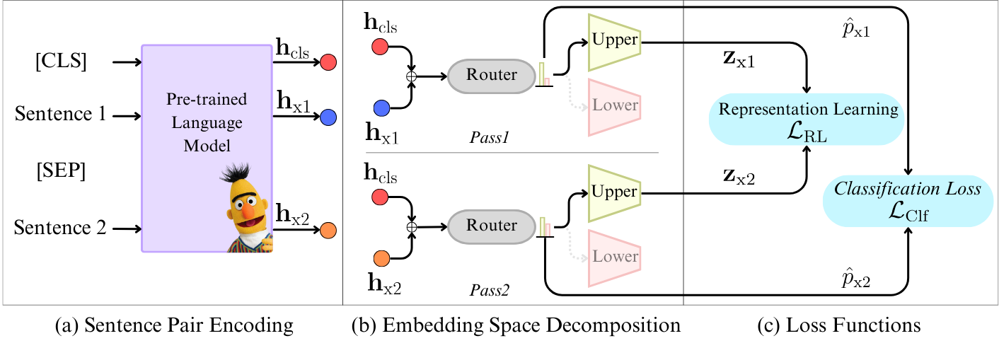

# MixSP: Space Decomposition for Sentence Embedding

This repository contains the code and pre-trained models for our paper [MixSP: Space Decomposition for Sentence Embedding](https://arxiv.org/abs/2406.03125).

## What is MixSP?
We introduce a novel embedding space decomposition method called MixSP utilizing a Mixture of Specialized Projectors. The novelty of MixSP lies in a carefully designed learning pipeline with the following traits: (i) the ability to distinguish upper-range from lower-range samples and (ii) the ability to accurately rank sentence pairs within each class. In particular, our method uses a routing network and two specialized projectors to handle upper-range and lower-range representations, resulting in a better STS performance overall.



## Installation

We recommend **Python 3.6** or higher, **[PyTorch 1.6.0](https://pytorch.org/get-started/locally/)** or higher and **[transformers v4.6.0](https://github.com/huggingface/transformers)** or higher. The code does **not** work with Python 2.7.

```
git clone https://github.com/KornWtp/MixSP
cd MixSP
pip install -e .
``` 

## Main results - STS

| Models  | BIOSSES | CDSC-R (Val) | CDSC-R (Test) | Avg. | 
| --------------------- | :-----: | :-----: | :-----: | :-----: |
|[MixSP-SBERT-BERT-Base](https://huggingface.co/kornwtp/mixsp-sbert-bert-base)              | 80.58 | 85.08 | 84.15 | 83.27 | 
|[MixSP-SimCSE-BERT-Base](https://huggingface.co/kornwtp/mixsp-simcse-bert-base)            | 82.61 | 88.27 | 85.28 | 85.39 |
|[MixSP-DiffAug-BERT-Base](https://huggingface.co/kornwtp/mixsp-diffaug-bert-base)          | 81.23 | 85.45 | 88.28 | 84.99 |
|[MixSP-SBERT-RoBERTa-Base](https://huggingface.co/kornwtp/mixsp-sbert-roberta-base)        | 76.01 | 85.60 | 81.21 | 80.94 |
|[MixSP-SimCSE-RoBERTa-Base](https://huggingface.co/kornwtp/mixsp-simcse-roberta-base)      | 80.74 | 84.48 | 80.41 | 81.88 |
|[MixSP-DiffAug-RoBERTa-Base](https://huggingface.co/kornwtp/mixsp-diffaug-roberta-base)    | 80.35 | 86.16 | 81.79 | 82.77 |

## Downstream tasks - Reranking and Binary Text Classification

| Models  | Reranking (Avg.) | Binary Text Classification (Avg.) |
| --------------------- | :-----: | :-----: |
|[MixSP-SBERT-BERT-Base](https://huggingface.co/kornwtp/mixsp-sbert-bert-base)              | 50.83 | 81.24 |
|[MixSP-SimCSE-BERT-Base](https://huggingface.co/kornwtp/mixsp-simcse-bert-base)            | 51.01 | 81.51 |
|[MixSP-DiffAug-BERT-Base](https://huggingface.co/kornwtp/mixsp-diffaug-bert-base)          | 52.94 | 81.45 |

## Usage
### Training data and Development data
We use the training data and development set from [sentence transformer](https://sbert.net/datasets/stsbenchmark.tsv.gz).

### Parameters
The full model parameters:
| Models  | alpha 1 | alpha 2 | Batch Size | Learning Rate |   
| --------------------- | :-----: | :-----: | :-----: | :----: |
|MixSP-SBERT-BERT-Base            | 7e-4  | 1e-4  | 16 | 5e-5 |
|MixSP-SimCSE-BERT-Base           | 5e-2  | 7e-2  | 16 | 5e-5 |
|MixSP-DiffAug-BERT-Base          | 7e-2  | 7e-3  | 16 | 5e-5 |
|MixSP-SBERT-RoBERTa-Base         | 7e-1  | 1e-4  | 16 | 5e-5 | 
|MixSP-SimCSE-RoBERTa-Base        | 7e-2  | 5e-2  | 16 | 5e-5 |   
|MixSP-DiffAug-RoBERTa-Base       | 7e-1  | 7e-4  | 32 | 5e-5 |  

### Train your own model
Please set the model's parameter before training.
```
>> bash running_script.sh
```
or
```
python main.py \
    --model_save_path experiments/mixsp-simcse-bert-base-model \
    --model_name_or_path princeton-nlp/sup-simcse-bert-base \
    --batch_size 16 \
    --max_seq_length 64 \
    --num_epochs 10 \
    --num_experts 2 \
    --top_routing 1 \
    --alpha_1 0.05 \
    --alpha_2 0.0005 \
    --learning_rate 5e-5
```

For finetuning model parameters: 
```
learning_rate_all=(5e-4 1e-4 5e-5 1e-5)
alpha_1=(1e-4 3e-4 5e-4 7e-4 1e-3 3e-3 5e-3 7e-3 1e-2 3e-2 5e-2 7e-2 1e-1 3e-1 5e-1 7e-1 1e-0)
alpha_2=(1e-4 3e-4 5e-4 7e-4 1e-3 3e-3 5e-3 7e-3 1e-2 3e-2 5e-2 7e-2 1e-1 3e-1 5e-1 7e-1 1e-0)
```

### Evaluation
To evaluate the model on STS task, please run:
```
python evaluation.py \
    --model_name_or_path "your-model-path" \
    --task_set sts 
```
To evaluate the model on binary text classification task, please run:
```
python evaluation.py \
    --model_name_or_path "your-model-path" \
    --task_set binary_classification 
```
For the reranking evaluation code, we use [MTEB](https://github.com/embeddings-benchmark/mteb)

## Citation

If you find this repository helpful, feel free to cite our publication [MixSP: Space Decomposition for Sentence Embedding](https://arxiv.org/abs/2406.03125):

```bibtex 
    @inproceedings{Ponwitayarat-etal-2024-mixsp,
    title = "Space Decomposition for Sentence Embedding",
    author = "Ponwitayarat, Wuttikorn  and
      Limkonchotiwat, Peerat  and
      Chuangsuwanich, Ekapol  and
      Nutanong, Sarana",
    booktitle = "Findings of the Association for Computational Linguistics: ACL 2024",
    year = "2024",
    publisher = "Association for Computational Linguistics",
}
```
